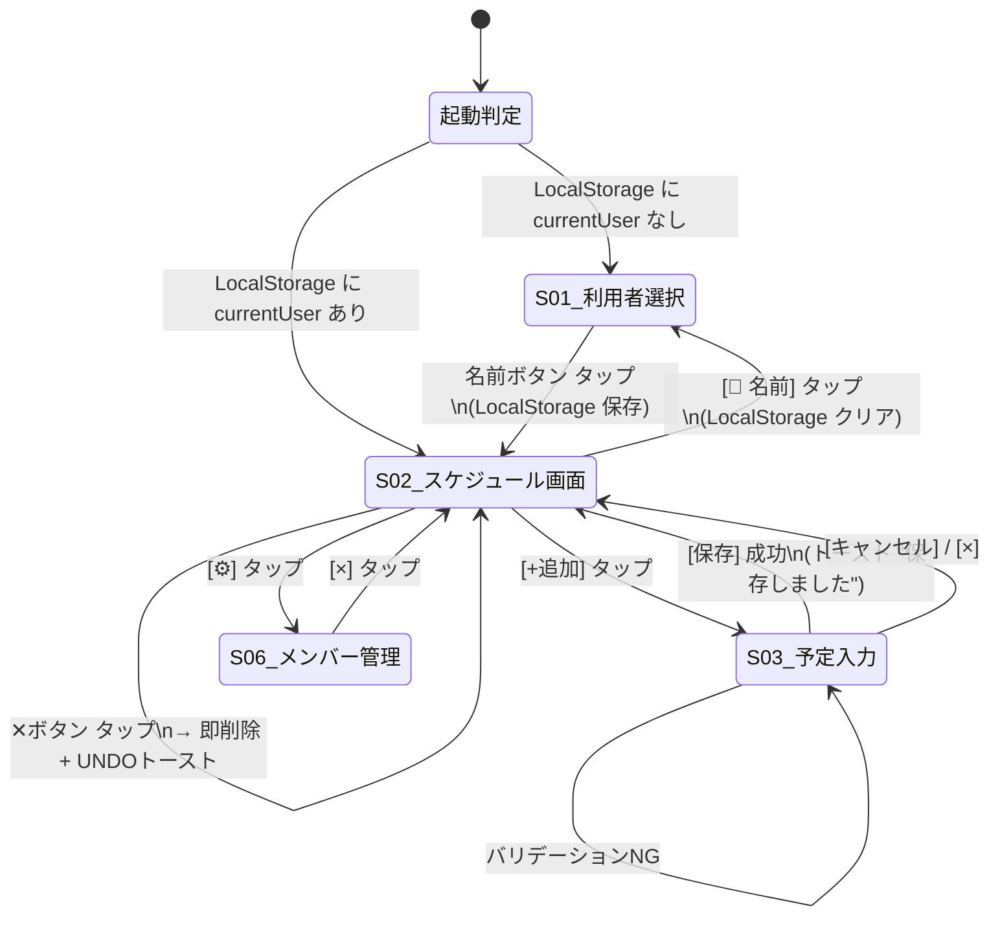

# 画面遷移図

- バージョン：v0.3
- 更新履歴：
  - v0.1：初版
  - v0.2：S-02 利用者切り替えボタン・S-06 メンバー管理モーダルの遷移追加
  - v0.3：予定編集インライン化に伴い S-04/S-05 遷移を削除、S-02 内インライン操作を追加
- 前提：[画面詳細仕様書](./02_screen_spec.md)

---

## 全体遷移図（Mermaid）



---

## テキスト形式遷移表

| 遷移元 | トリガ | 遷移先 | 備考 |
|---|---|---|---|
| 起動 | LocalStorage に currentUser なし | S-01 | FR-20 初回 |
| 起動 | LocalStorage に currentUser あり | S-02 | FR-20 2回目以降 |
| S-01 | 名前ボタン（いずれか）タップ | S-02 | currentUser を LocalStorage に保存 |
| S-02 | `👤 名前` タップ | S-01 | LocalStorage をクリア（利用者切り替え） |
| S-02 | `+追加` タップ | S-03 | 初期値を流し込み |
| S-02 | 予定行タップ | S-02（インライン編集） | テキストエリアに切り替わる。Enter/blur で保存、Escape でキャンセル |
| S-02 | 予定行 長押し / ダブルタップ | （遷移なし） | FR-23 誤操作防止 |
| S-02 | ✕ボタン タップ | S-02（削除後） | PUT/DELETE、UNDOトースト5秒 |
| S-02 | `⚙` タップ | S-06 | メンバー管理モーダルを開く |
| S-02 | 左フリック | S-02 | viewDate += 1 |
| S-02 | 右フリック | S-02 | viewDate -= 1 |
| S-02 | `今日に戻る` タップ | S-02 | viewDate = today |
| S-06 | `×` タップ | S-02 | メンバー管理モーダルを閉じる |
| S-03 | `保存` 成功 | S-02 | POST /api/schedules 201、トースト |
| S-03 | バリデーションNG | S-03 | エラーメッセージ表示 |
| S-03 | `キャンセル` / `×` | S-02 | 破棄 |

---

## フリック方向と日付の関係（補足）

```
  ← 左フリック                     右フリック →
  (未来へ)                       (過去へ)

  viewDate = today-2, today-1
        │
        │  右フリック
        ▼
  viewDate = today-1, today
        │
        │  右フリック
        ▼
  viewDate = today, today+1   ← 初期表示（[今日に戻る] でも戻る）
        │
        │  左フリック
        ▼
  viewDate = today+1, today+2
        │
        │  左フリック
        ▼
  viewDate = today+2, today+3
```

- 画面の左に「早い日付」、右に「遅い日付」を表示する。
- 左スワイプ（指を左へ）＝カレンダーを前進 → 未来
- 右スワイプ（指を右へ）＝カレンダーを後退 → 過去
